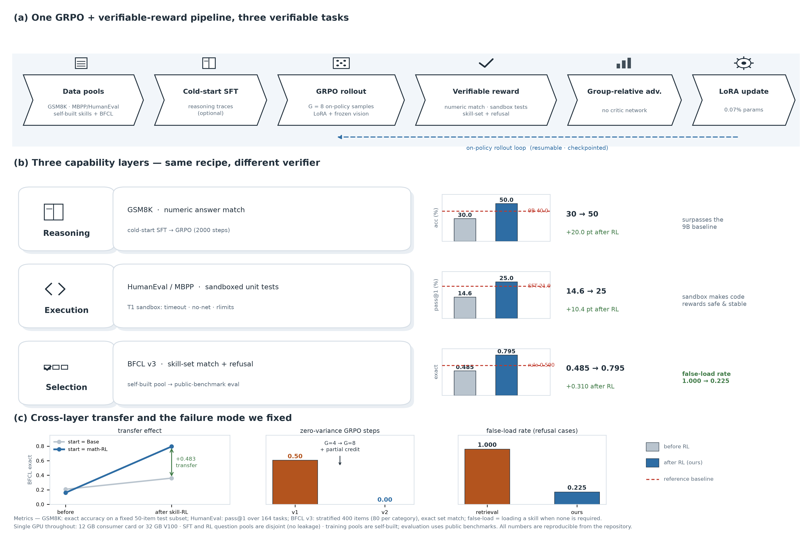

<div align="center">

# Three-Layer Agentic RLVR on Qwen3.5-4B

**Reasoning · Code Execution · Skill Selection — one GRPO + verifiable-reward pipeline, single-GPU reproducible.**

`Python 3.11` · `PyTorch` · `TRL 1.12 (GRPO)` · `transformers 5` · `peft/LoRA` · single GPU (12 GB consumer or 32 GB V100)

</div>



---

## Highlights (all numbers measured, evidence in [`evidence/`](evidence/))

| Layer | Task (verifier) | Baseline → Ours | Reference |
|-------|-----------------|-----------------|-----------|
| **Reasoning** | GSM8K (numeric match) | 30.0% → **50.0%** | surpasses the same-generation **9B baseline: 40.0%** |
| **Execution** | HumanEval / MBPP (sandboxed unit tests) | 14.6% → **25.0%** | math cold-start SFT alone already gives **+7.3 pt** |
| **Selection** | BFCL v3 (skill set + refusal) | 0.207 → **0.795** exact | retrieval 0.485 / rule 0.590; **false-load 100% → 22.5%** |

Two findings we consider the most valuable:

1. **Why RL can silently fail, and how to fix it.** With group size 4 and a binary reward, **50% of GRPO steps had zero intra-group reward variance** (advantage = 0 → no gradient). Enlarging the group (4→8) and adding partial-credit reward drove that to **0**, turning a zero-net-gain run (GSM8K 34%→34%) into **34% → 50%**.
2. **Cross-task transfer.** Skill-selection RL gains **+63.5 pt** when started from a *math-RL* checkpoint, versus **+15.2 pt** from Base → a **+48.3 pt transfer effect**. Note math RL by itself does *not* improve selection (0.160 vs 0.207) — the checkpoint is a better *starting point*, not a better selector.

## What is in the box

| Layer | Directory | Reward |
|-------|-----------|--------|
| Shared pipeline (data, SFT, GRPO, eval, comparison) | [`scripts/`](scripts/) | numeric match + format/length |
| Code execution | [`code_rl/`](code_rl/) | sandboxed unit tests (custom T1 sandbox: hard timeout, process-group kill, network isolation, rlimits, temp cwd) |
| Skill selection | [`memoryRL/`](memoryRL/) | skill-set match + explicit refusal; **training pool self-built, evaluation on public BFCL** (leakage-free) |

```
scripts/    shared GRPO+RLVR pipeline (prepare_data, run_sft, run_grpo, evaluate, compare)
code_rl/    code layer + T1 sandbox + HumanEval/MBPP pools
memoryRL/   skill-selection layer (self-built skill library, BFCL eval, two-arm transfer study)
configs/    hyperparameters: 12 GB / server / v2 (group size 8 + partial credit)
figures/    method overview (regenerable: figures/method_overview.py → png + pdf)
tables/     research-style tables (LaTeX booktabs + Markdown), generated from evidence
evidence/   curated raw evidence: result JSONs, training logs, skill training curve
docs/       internal working notes (not for external readers)
```

## Quick start

```bash
pip install -i https://pypi.tuna.tsinghua.edu.cn/simple -r requirements.txt   # or plain PyPI
python scripts/check_env.py                       # verifies CUDA / versions / cache paths
python scripts/download_models.py --model Qwen/Qwen3.5-4B-Base

# 1) Reasoning layer (GSM8K)
GRPO_CONFIG=configs/grpo_config.v2.yaml MATH_OUT=outputs/qwen3.5-4b-grpo-v2 \
  MATH_TAG=grpo-v2 GRPO_MAX_STEPS=2000 bash run_full_pipeline.sh

# 2) Execution layer (HumanEval, starts from the math SFT checkpoint)
CODE_CONFIG=code_rl/code_config.v2.yaml CODE_MAX_STEPS=800 bash code_rl/run_code_pipeline.sh

# 3) Selection layer (BFCL) — baselines are CPU-only and finish in seconds
python memoryRL/evaluate_skill.py --model similarity --tag B-similarity
bash memoryRL/run_skill_pipeline.sh               # two-arm training + evaluation

# 4) Full-suite evaluation (GSM8K 1319 + BFCL 2771)
nohup bash run_full_eval.sh > logs/full_eval.log 2>&1 &
```

All pipelines are **idempotent / resumable**: training resumes from the latest checkpoint, evaluation is redone when the weights are newer than the result file.

## Method in one paragraph

Data pools → optional cold-start SFT → **GRPO** with `G = 8` on-policy samples per prompt → a **verifiable reward** (numeric match / sandboxed unit tests / skill-set match with refusal) → group-relative advantage (no critic) → LoRA-only policy update on a frozen vision tower. Everything runs on a single GPU; SFT and RL question pools are disjoint, and evaluation is always performed on held-out public benchmarks.

## Documentation

| Document | What it is |
|----------|------------|
| [`FINAL_REPORT.md`](FINAL_REPORT.md) | Consolidated report: background, method, all results, conclusions, limitations, reproduction commands |
| [`EXPERIMENT_REPORT.md`](EXPERIMENT_REPORT.md) | Detailed experiment log incl. the v1→v2 analysis and the skill-selection study |
| [`tables/ALL_TABLES.md`](tables/ALL_TABLES.md) | All result tables (Markdown) |

## Honest limitations

- Reasoning numbers are on a fixed **50-item** GSM8K subset (full 1319-item suite is one command away: `run_full_eval.sh`); the skill-selection numbers use a **stratified 400** BFCL subset.
- AIME2024 is **not discriminative** for these models (4B/9B both score ~0) and is therefore never used as evidence.
- The skill-selection training pool is self-built (818 items); the transfer study covers two arms only.
- The 9B comparison is on GSM8K only.

> Personal notes, day-to-day ops logs and resume drafts are deliberately kept **out of this repository**.

## Acknowledgements

Models: [Qwen3.5](https://huggingface.co/Qwen) (Apache-2.0). Datasets/benchmarks: [GSM8K](https://huggingface.co/datasets/openai/gsm8k), [MBPP](https://huggingface.co/datasets/google-research-datasets/mbpp), [HumanEval](https://huggingface.co/datasets/openai/openai_humaneval), [BFCL](https://gorilla.cs.berkeley.edu/leaderboard.html). Tooling: [TRL](https://github.com/huggingface/trl), [transformers](https://github.com/huggingface/transformers), [PEFT](https://github.com/huggingface/peft).

## License

Not added yet — the author intends a permissive license (MIT or Apache-2.0). Until then, © the author, all rights reserved.
